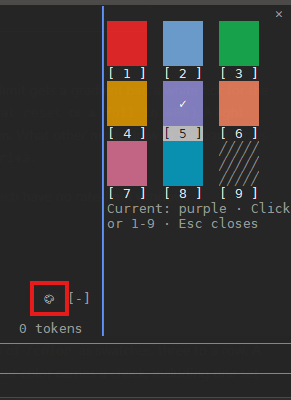
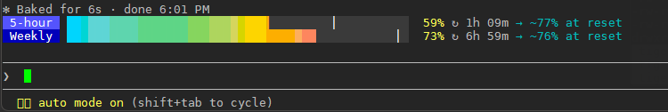

# claude-mods

Personal [Claude Code mods](https://code.claude.com/docs/en/plugins/mods/overview), packaged as a plugin marketplace named `local-mods`.

Requires Claude Code 2.1.287 or later.

## Setup

```bash
git clone https://github.com/tiger42/claude-mods.git ~/claude-mods
claude plugin marketplace add ~/claude-mods
```

The marketplace is a local folder, so Claude Code reads each mod straight from the clone. To update: `git pull`, then `/reload-plugins` in any open session.

## Enable a mod

```bash
claude plugin install <mod>@local-mods --scope user     # all projects
claude plugin install <mod>@local-mods --scope project  # this repo, via .claude/settings.json
claude plugin disable <mod>@local-mods                  # turn off again
```

Or use `/plugin` in a session. Run `/reload-plugins` to load a mod into a session that is already open.

## Mods

### color-chooser



A 🎨 button at the right end of the band above the prompt opens a picker with the session colors of `/color` as swatches, three to a row. A click on a swatch or its digit sets the color and closes the picker; Esc closes it unchanged. The current color carries a check, including one set with a typed `/color`. `/colors` opens the picker too, for when the band is collapsed.

The swatches are painted through the theme exactly as the prompt bar is, so they look the same in any color depth. With 256 colors or more the picker offers all eight colors and `default`. In 16 colors (`TERM=xterm` with no `COLORTERM`, typical over SSH) orange draws as red, blue as cyan and pink as purple, so it offers only red, green, yellow, purple, cyan and `default`; `COLORTERM=truecolor` brings the rest back if the terminal supports it. To switch it on, check that `printf '\e[38;2;217;119;87m██ orange\e[0m\n'` prints orange rather than red, then add `export COLORTERM=truecolor` to the shell profile (`~/.bashrc`) of the machine Claude Code runs on, the server when you connect over SSH, and start Claude Code anew. A session moved to the background (from the sessions overview) always runs in full color, whatever the terminal it was started from, so the picker there offers all eight.

Shares the band with other mods: the button sits beside whatever they draw there. Terminal only: the session color tints the terminal's prompt bar and nothing in the Desktop app, so the button and `/colors` stay out of other surfaces.

```bash
claude plugin install color-chooser@local-mods --scope user
```

### usage-band



Band above the prompt showing the 5-hour and weekly rate limits of a Claude subscription. Each limit gets a gradient bar, a white tick for the time elapsed in the window, a countdown to the reset and a forecast at the current rate (`→ ~75% at reset` or `▲ full in 40m`). A light sweeps the bars while Claude works. A new session starts from the last reading of any other session. What other mods draw in the band stays beside the bars, or moves under them when there is no room. Collapse the band with `ctrl+x ctrl+a`.

Draws in the terminal and in the Desktop app's Code tab. Shows nothing for API-key accounts, which have no rate-limit windows.

```bash
claude plugin install usage-band@local-mods --scope user
```

## Development

```bash
claude --plugin-dir ./<mod>      # load a working copy, hot-reloads on save
claude plugin validate ./<mod>   # manifest and static analysis of the hooks module
claude plugin test ./<mod>       # runs <mod>/tests/*.test.ts(x)
```

`--plugin-dir` writes type declarations to `<mod>/.claude-plugin/types/` (git-ignored). Type-checking needs TypeScript 5.4 or later.

To add a mod, create its folder, list it under `plugins` in `.claude-plugin/marketplace.json` and add a section above.

## License

[MIT](LICENSE)
